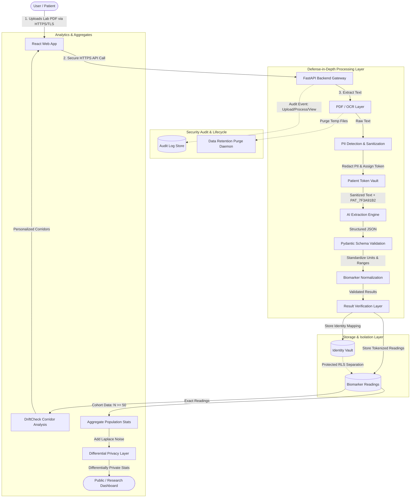

# DriftCheck Privacy and Security Architecture

> **Notice**: DriftCheck is a hackathon prototype designed for preventive health awareness and longitudinal biomarker tracking. It is **not** a certified clinical production system and is not certified for clinical diagnostic decision-making. The system implements a defense-in-depth architecture to maximize data privacy and confidentiality. We do not make misleading claims of being "100% anonymous" or "100% secure," but enforce rigorous data governance controls.

---

## 1. Data Minimization

Patient laboratory reports contain a wealth of sensitive personal, administrative, and clinical information. DriftCheck adheres strictly to the **principle of data minimization**:

- **Targeted AI Extraction**: The AI extraction pipeline receives and processes **only** the laboratory attributes strictly required for longitudinal drift analysis:
  - Biomarker / Test name (e.g., *Ferritin*, *Hemoglobin*, *TSH*)
  - Quantitative result value (e.g., *18.2*)
  - Unit of measurement (e.g., *ng/mL*, *g/dL*)
  - Reference range (e.g., *15 – 150 ng/mL*)
  - Report / Specimen collection date (e.g., *2026-04-15*)
  - Laboratory name (for tracking inter-lab calibration variance)
- **Exclusion of Unnecessary Context**: Clinical notes, diagnostic impressions, billing codes, attending physician details, patient address, phone numbers, and emergency contact details are filtered out prior to downstream processing.
- **Identity Isolation**: Patient identity is strictly decoupled from the laboratory dataset before ingestion into analytical models.

---

## 2. Patient Tokenization

Direct patient identifiers (names, Social Security / National IDs, Medical Record Numbers) are never repeatedly stored alongside laboratory values.

Instead, the system assigns each patient an opaque, cryptographically random internal token:

```text
Format: PAT_<8-CHARACTER-HEX-CSPRNG>
Example: PAT_7F3A91B2
```

### Architecture

```text
┌──────────────────────────────────────────────────────────┐
│                   Patient Identity                      │
│            (Name, Email, Auth User ID)                  │
└────────────────────────────┬─────────────────────────────┘
                             │
                             ▼
┌──────────────────────────────────────────────────────────┐
│         Identity Mapping / Token Vault (Isolated)        │
│          • Restricted RLS Policies                       │
│          • Decoupled from public API access              │
└────────────────────────────┬─────────────────────────────┘
                             │
                             ▼
                        PATIENT_TOKEN
                        (PAT_7F3A91B2)
                             │
                             ▼
┌──────────────────────────────────────────────────────────┐
│                    Laboratory Data                       │
│        (Token, Biomarker, Value, Unit, Range, Date)      │
└──────────────────────────────────────────────────────────┘
```

### Key Security Safeguards
1. **Unpredictability & Cryptographic Entropy**: Tokens are generated via a Cryptographically Secure Pseudo-Random Number Generator (CSPRNG, `secrets.token_hex(4)`), delivering 32 bits to 64 bits of entropy. Tokens are **never** derived via hashing or hashing-with-salt of guessable attributes such as:
   - Full Name
   - Date of Birth
   - Phone Number
   - Email Address
2. **Hidden Generation Mechanism**: The token generation routine and salt vaults exist solely on the secure backend service and are never exposed to the frontend client.

---

## 3. PII Detection and Minimization Pipeline

Before any extracted document content or raw OCR text is transmitted to an external Large Language Model (AI) API, it passes through an automated redaction and sanitization pipeline:

1. **Detection**: Rule-based regex and named-entity heuristics identify direct patient identifiers:
   - Patient Full Name
   - Date of Birth (DOB) and Age
   - Government Identification / Medical Record Numbers (MRN)
   - Phone numbers and Email addresses
   - Physical street addresses
   - Attending physician and clinical staff names
2. **Redaction / Replacement**: Unnecessary identifiers are permanently scrubbed. Required patient linkage is substituted with the internal `patient_token`.
3. **Payload Inspection**: The output payload sent to the AI model contains strictly the numerical and categorical test definitions.

### Transformation Example

#### Original Report Extract:
```text
CLINICAL LABORATORY REPORT
Hospital: Metro General Health System
Physician: Dr. Robert Vance, MD
Patient Name: Jane Doe
DOB: 15/04/1988
Patient ID: MRN-998241
Phone: (555) 019-2834

Hemoglobin: 11.2 g/dL (Reference: 12.0 - 15.5 g/dL)
Ferritin: 18 ng/mL (Reference: 15 - 150 ng/mL)
Report Date: 12/03/2026
```

#### Sanitized AI Input:
```text
Patient Token: PAT_7F3A91B2
Report Date: 2026-03-12
Laboratory: Metro General Health System

Hemoglobin: 11.2 g/dL | Ref: 12.0 - 15.5 g/dL
Ferritin: 18 ng/mL | Ref: 15 - 150 ng/mL
```

No unnecessary Personally Identifiable Information (PII) is disclosed to the AI provider.

---

## 4. Encryption Standards

DriftCheck enforces cryptographic protection across all data states:

### 4.1 In Transit
All network boundaries enforce modern Transport Layer Security (TLS 1.3 preferred, TLS 1.2 minimum):
- **React Frontend → FastAPI Backend**: HTTPS / TLS with strict HSTS headers.
- **FastAPI Backend → Supabase**: TLS encrypted PostgreSQL connection pooling (port 5432 / 6543) and HTTPS REST API endpoints.
- **FastAPI Backend → External AI Provider**: HTTPS / TLS encrypted API calls with strict certificate validation.

### 4.2 At Rest
- **Database Storage**: Supabase underlying storage and disk volumes use AES-256 block encryption.
- **Secret Management**:
  - Zero hardcoded secrets, database credentials, or API keys in source code or Git history.
  - Development and production keys are injected via environment variables (`.env` files excluded via `.gitignore`).
  - Strict linting and pre-commit scans prevent credential leakage.

---

## 5. Supabase Security & Row Level Security (RLS)

DriftCheck leverages PostgreSQL Row Level Security (RLS) within Supabase to guarantee tenant data isolation:

- **Row Level Isolation**: Every table containing patient readings or identity mappings has RLS enabled (`ALTER TABLE ... ENABLE ROW LEVEL SECURITY`).
- **Owner-Only Access**: Patients can only select, insert, or update rows associated with their authenticated session (`auth.uid()`).
- **Key Separation**:
  - `VITE_SUPABASE_ANON_KEY`: Safe for exposure in the React frontend. Grants access only via RLS policies matching the authenticated user.
  - `SUPABASE_SERVICE_ROLE_KEY`: Reserved strictly for backend services (FastAPI). Never bundled in client build artifacts.
- Detailed RLS SQL policies and role grants are documented in [`docs/SUPABASE.md`](docs/SUPABASE.md).

---

## 6. Logical Separation of Identity Data

Patient identity information and longitudinal lab readings are maintained in logically distinct relational entities:

```text
IDENTITY DATA (identity_vault)
--------------------------------------
id                 UUID (Primary Key)
auth_user_id       UUID (references auth.users.id)
email              VARCHAR
patient_token      VARCHAR (Unique, e.g., PAT_7F3A91B2)
created_at         TIMESTAMPTZ

                │
                │ Protected One-Way / Service-Role Mapping
                ▼

LABORATORY DATA (biomarker_readings)
--------------------------------------
id                 UUID (Primary Key)
patient_token      VARCHAR (references identity_vault.patient_token)
biomarker_id       VARCHAR (e.g., 'ferritin', 'hemoglobin')
test_date          DATE
value              NUMERIC(10, 3)
unit               VARCHAR
reference_low      NUMERIC(10, 3)
reference_high     NUMERIC(10, 3)
lab_name           VARCHAR
created_at         TIMESTAMPTZ
```

Longitudinal drift calculations, mean baseline corridors, and trend detection algorithms operate exclusively on the `biomarker_readings` dataset using `patient_token`. The analytics engine requires zero knowledge of the patient's legal name, email, or contact information.

---

## 7. Differential Privacy (Aggregate Analytics Only)

> [!IMPORTANT]
> **No Differential Privacy Noise on Individual Records**:
> Differential privacy noise is **NEVER** injected into an individual patient's stored laboratory records or personal drift corridor calculations. Longitudinal biological monitoring requires unperturbed, clinically accurate values to detect subtle physiological drift.

### Differential Privacy for Population Aggregates
Differential privacy is reserved exclusively for aggregate cohort queries and population-level health statistics:

```text
Individual Patient Stored Records (Exact, Unperturbed)
                   │
                   ▼
       Cohort Query / Group Aggregation
       (e.g., Mean Ferritin among Cohort X, N > 50)
                   │
                   ▼
     Differential Privacy Mechanism
     (Laplace / Gaussian Noise: Scale = Δf / ε)
                   │
                   ▼
    Differentially Private Public / Research Statistic
```

- **Future Use Cases**:
  - Population-wide biomarker averages and age-stratified normal drift trajectories.
  - Research studies examining seasonal variation in Vitamin D or HbA1c.
  - Public epidemiological dashboards.
- **Privacy Guarantee**: An individual's inclusion or exclusion in the aggregate dataset cannot be reverse-engineered, bounded by privacy budget $\epsilon$ (epsilon).
- **Core Principle**: Differential privacy functions as an additional mathematical privacy guarantee for aggregate distribution, **not** as a substitute for encryption, authentication, or row-level access control.

---

## 8. Audit Logging

To maintain forensic traceability and meet data governance standards, all security-relevant interactions are logged without persisting sensitive clinical details:

### Tracked Security Events
1. `REPORT_UPLOADED`: Lab PDF or image submitted for processing.
2. `REPORT_PROCESSED`: Document OCR, PII sanitization, and structured extraction completed.
3. `REPORT_VIEWED`: Patient or authorized entity accessed a processed report.
4. `REPORT_MODIFIED`: Corrected or updated biomarker values.
5. `REPORT_CONFIRMED`: User verified and accepted the baseline corridor.
6. `REPORT_DELETED`: User purged a reading or baseline report.
7. `PATIENT_RECORD_ACCESSED`: Identity vault or profile data retrieved.

### Logging Guardrails
- **Zero Raw Lab Text**: Audit logs record metadata (timestamp, event type, actor token, report ID, IP hash, user agent), but **never** log raw medical text, diagnostic interpretations, or numerical lab values.
- **Zero Direct PII**: Log records reference `patient_token`, not email addresses or patient names.

---

## 9. Data Retention & Temporary File Purge

Unprocessed medical documents must not accumulate indefinitely. DriftCheck implements a strict, configurable lifecycle for uploaded PDF and image files:

```text
1. PDF / Image Uploaded by Patient
               │
               ▼
2. Temporary Secure Storage (Encrypted Scratch Buffer)
               │
               ▼
3. OCR & PII Sanitization Completed
               │
               ▼
4. Structured Biomarker Data Validated & Saved (Supabase)
               │
               ▼
5. Immediate Purge of Temporary File (TTL: 0 to Max 24 Hours)
```

- **Default Retention**: Temporary files are deleted immediately after structured extraction and user verification.
- **Configurability**: In test environments or debugging modes, an optional retention window (e.g., 1 hour, 24 hours) can be configured via `PDF_RETENTION_MINUTES`.
- **Zero Indefinite File Retention**: Uploaded PDF binary blobs are never stored indefinitely without explicit user consent and clinical retention mandates.

---

## 10. AI Provider Privacy & Configuration

- **Pluggable & Configurable Provider**: The backend AI extraction adapter is configurable (supporting self-hosted local models, private enterprise endpoints, or commercial LLM APIs via environment settings `AI_PROVIDER` and `AI_MODEL_NAME`).
- **Pre-Call Sanitization**: No raw PII, credentials, system keys, or patient identity fields are sent to the AI provider.
- **Contractual & Compliance Prerequisites**: In a production healthcare deployment, the AI provider must support a Business Associate Agreement (BAA under HIPAA) or equivalent GDPR Article 28 Data Processing Agreement ensuring zero retention and zero training on customer health prompts.

---

## 11. Frontend Privacy Status & User Transparency

The DriftCheck user interface provides transparent, truthful privacy notices without exaggerated marketing claims:

- **Clear Privacy Notice**:
  > **Privacy Protected**
  >
  > Your laboratory data is protected using secure data handling, tokenized patient identifiers, access controls, and encryption.
  >
  > Only the information required to process your laboratory results is used.

- **Realistic & Honest Disclaimers**:
  - We do **not** claim the app is "100% anonymous" or "100% secure".
  - The interface clearly informs users that DriftCheck is a **hackathon prototype and research tool**, not an FDA/CE-cleared clinical diagnostic device.

---

## 12. Complete Defense-in-Depth Architecture Diagram


